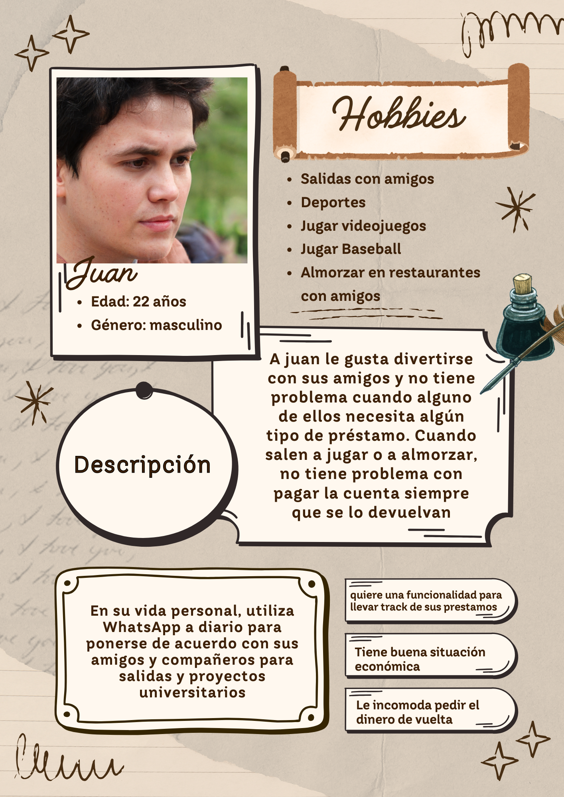

---

## Metas de Usuario

Para aterrizar la definición del problema en necesidades concretas y personales, he definido tres metas puntuales que mis usuarios (tanto el que presta como el que debe) buscan alcanzar con el nuevo feature de cobros y recordatorios.

### Meta 1

Cobrar dinero sin sentir vergüenza.

Historia de usuario: Yo Pedro, como un amigo que suele prestar dinero en salidas sociales, quiero que se envíe un recordatorio de cobro neutral y automatizado para recuperar mi dinero sin sentir la "pena" de tener que escribir un mensaje de cobro directo que incomode la amistad.

### Meta 2

Recordar pagar las deudas a tiempo.

Historia de usuario: Yo Diego, como una persona distraída que a veces olvida sus pendientes, quiero recibir una notificación clara y visible dentro de whatsapp para recordar que debo pagarle a mi amigo y no quedar como alguien irresponsable.

### Meta 3

Organizar mis préstamos activos.

Historia de usuario: Yo Divas, como un usuario que cuida sus finanzas personales, quiero tener un registro visual de a quién le he prestado y cuánto para llevar un control ordenado de mi dinero y evitar confusiones o malentendidos sobre los montos pendientes.

# Mapa de empatía

• **¿Quién es el sujeto?** Diego, un estudiante universitario que maneja un presupuesto ajustado y valora sus relaciones sociales.

• **¿Qué necesita hacer?** Necesita recuperar su dinero de forma diplomática para cubrir sus propios gastos, sin generar un conflicto social ni sentir la vergüenza de tener que pedir algo que es suyo.

## Persona 

