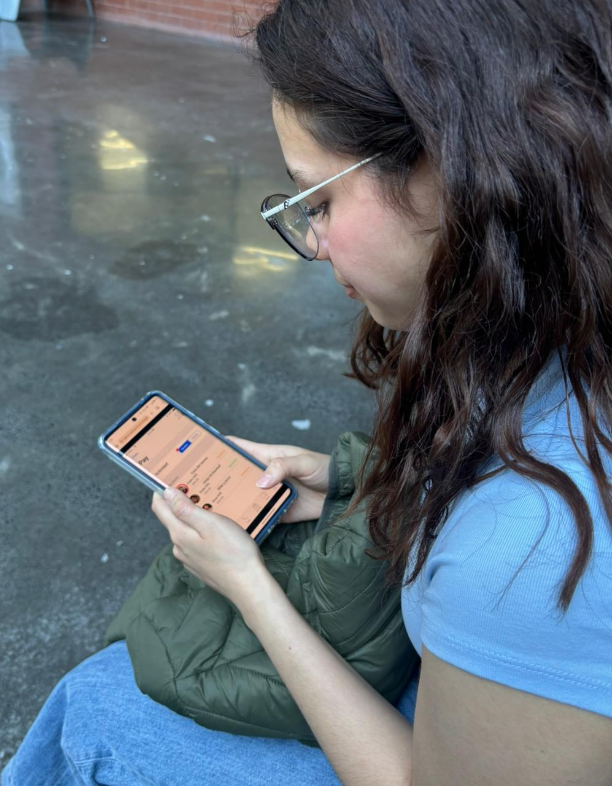

---
# Perfil del usuario 

>[!SUMMARY] Datos
> Edad: 21 años
> Género: Femenino

---

# Preguntas durante la prueba

**1. ¿Cuál crees que es la notificación en esta pantalla? (en la pantalla de deudas)** 

Hay como un círculo rojo en la parte que dice deudas, entonces supongo que es lo que debo de la cena del viernes. O sea, lo que no les pagué a mis amigos.

**2. ¿Cómo realizarías la transferencia para saldar tu deuda?** 

Seleccionaría el circulito de Pedro y me aseguraría de que sí sea el monto. Luego vería el mensaje y le daría a transferir.

**3. Cuando ya hiciste la transferencia, ¿cómo harías para revisarla o guardarla como evidencia?** 

O sea, vuelvo a seleccionar el pago y me sale la fecha, el mensaje, el monto y un PDF. Es como en los bancos, ¿no? Que lo seleccionas y ya te da toda la información.

--------------------------------------------------------------------------------

# Preguntas después de la prueba

**1. ¿Qué tan fácil de utilizar sentiste la aplicación?** 

En una escala del uno al cinco, lo sentí un cuatro.

**2. ¿Crees que la aplicación sería útil para tu vida diaria?** 

Sí, porque muchas veces pasa que yo pongo la tarjeta o tal vez otra persona la pone y le tengo que pagar. Es más fácil estarse recordando así para tener las cuentas claras.

**3. ¿Agregarías alguna funcionalidad al diseño?** 

Yo agregaría que a todos los que les debo se les mantenga un círculo rojo en su foto de perfil hasta que les pague. También, que la notificación en el botoncito de deudas salga siempre que haya una deuda nueva.

**4. ¿Crees que cualquier tipo de usuario puede utilizar de forma fácil la aplicación?** 

Para adultos mayores no creo que sea tan fácil; pensándolo para mi abuela, no creo que lo entendería. Siento que va más dirigido a jóvenes.

**5. ¿Qué cambios harías, si tuvieras alguno?** 

Tal vez solo eso, que se mantenga en rojo lo que debo con un circulito en rojo.