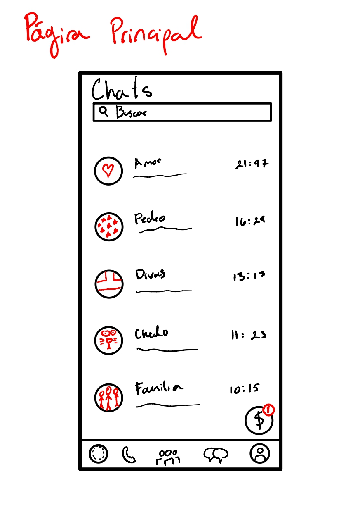
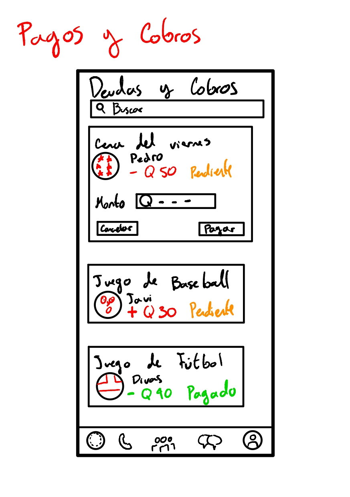
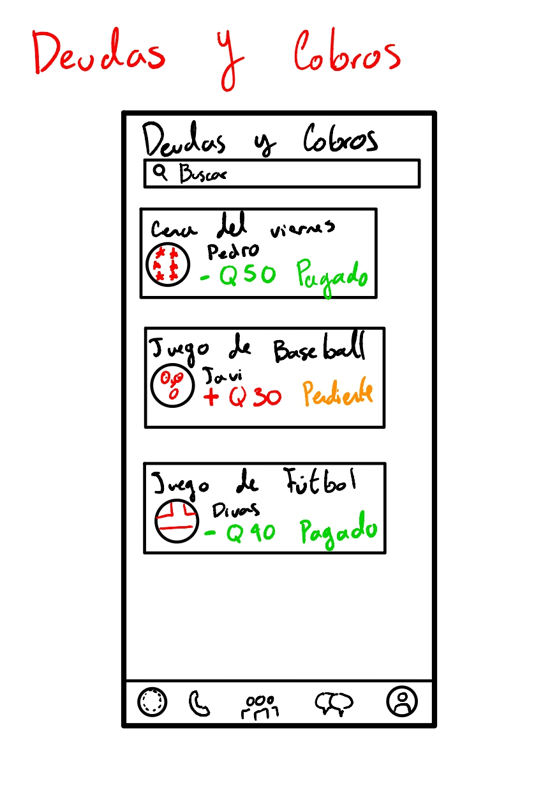

---

# Página principal

- Una breve descripción de cómo esperan que el usuario interactúe con su pantalla.
	- Espero que el usuario utilice su whatsapp de manera normal, únicamente con la opción de revisar sus notificaciones de deudas y cobros. 
- ¿Qué pasa si su usuario no sigue el camino perfecto?
	- no pasa nada, puede usar whatsapp de manera normal y cuando desee ingresar a whatsapp pay
- ¿Qué manera de pensar podría llevar a su usuario a seguir un camino distinto?
	- Tal vez el usuario podría pensar que es un chat o algo similar, e ingresar a whatsapp pay sin desearlo.
- ¿Qué información necesitan llevar de una pantalla a otra?
	- Necesitan el ícono de whatsapp pay y también las notificaciones en pantalla. 
- ¿Qué posibles cambios de estado podrían ocurrir en sus pantallas?
	- El usuario puede ingresar mediante el ícono de whatsapp pay hacia las pantallas de cobros y deudas, y también se pueden mostrar notificaciones en la pantalla principal. 

---
# Página Deudas y Cobros

- Una breve descripción de cómo esperan que el usuario interactúe con su pantalla.
	- El usuario puede ver sus deudas y cobros pendientes o realizados, los negativos son deudas y los positivos son cobros (ingreso de dinero). Espero que el usuario pueda ver sus transacciones e ingresar a cada una de ellas para ver más detalles, como fecha o estado. 
- ¿Qué pasa si su usuario no sigue el camino perfecto?
	- No pasa nada, puede continuar usando la app sin problema
- ¿Qué manera de pensar podría llevar a su usuario a seguir un camino distinto?
	- el no ver correctamente el estado de la transacción o cual es la que tiene notificación puede llevar al usuario a seleccionar otra sin ser la correcta
- ¿Qué información necesitan llevar de una pantalla a otra?
	- los estados y el nombre de la transacción debe mantenerse cuando se cambie de pantalla, y la notificación.
- ¿Qué posibles cambios de estado podrían ocurrir en sus pantallas?
	- Las transacciones notificadas pueden pasar a ya no tener el símbolo de notificación si se exploran 

---

# Página Pagos y Cobros

- Una breve descripción de cómo esperan que el usuario interactúe con su pantalla.
	- en esta pantalla se ven los detalles de la transacción, espero que el usuario pueda ingresar el monto requerido y ver a quien le está haciendo la transacción y por qué motivo
- ¿Qué pasa si su usuario no sigue el camino perfecto?
	- podría realizar otra de sus transacciones pendientes por accidente si ingresa en otra.
- ¿Qué manera de pensar podría llevar a su usuario a seguir un camino distinto?
	- que no sea muy clara cual transacción tiene la notificación que estaba revisando.
- ¿Qué información necesitan llevar de una pantalla a otra?
	- todos los detalles de la transacción
- ¿Qué posibles cambios de estado podrían ocurrir en sus pantallas?
	- cuando se realice el pago ya no saldría como pendiente, sino como realizado, y cambiaría de rojo a verde. 

---

# Página Deudas y Cobros pagado

El usuario puede ver el cambio en el estado de la deuda y como ahora está pagado

---

# Página Pagos y Cobros de un pago hecho 

- Una breve descripción de cómo esperan que el usuario interactúe con su pantalla.
	- En este caso, espero que el usuario pueda ver los detalles de aquellas deudas o cobros ya realizados, para que pueda ver la fecha, la hora, los detalles e imprimir algún recibo si quisiera. 
- ¿Qué pasa si su usuario no sigue el camino perfecto?
	- puede ver otras transacciones pendientes o realizadas
- ¿Qué manera de pensar podría llevar a su usuario a seguir un camino distinto?
	- no darse cuenta que dice pagado y meterse a una transacción pendiente y pensar que no ha pagado algo que ya pagó
- ¿Qué información necesitan llevar de una pantalla a otra?
	- todos los detalles de la transacción 
- ¿Qué posibles cambios de estado podrían ocurrir en sus pantallas?
	- cuando se presiona la transacción, se muestran los detalles, luego se ocultan cuando se sale de los detalles. y al presionar print se imprime un recibo en pdf. 

