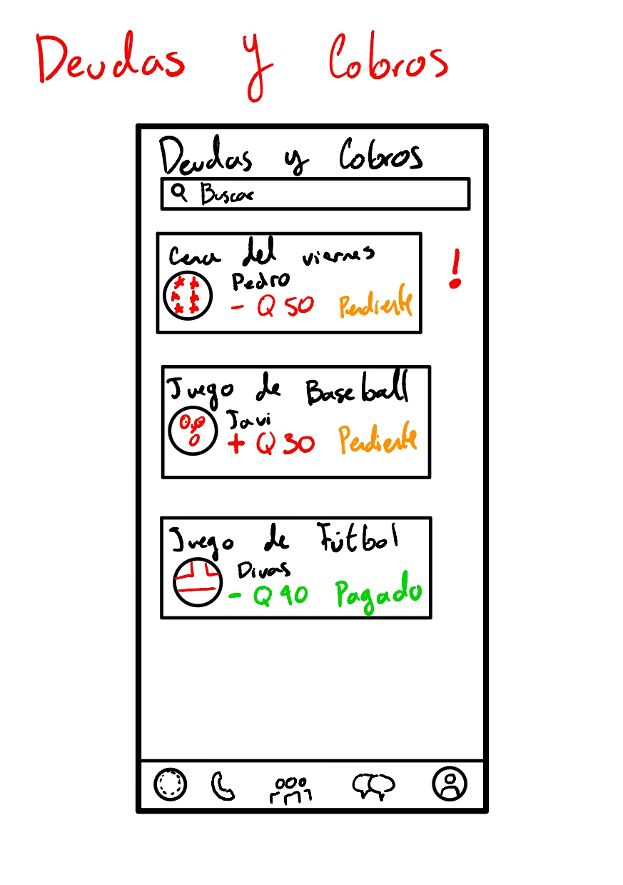

---

# Página principal

![[prototipo-page1.jpg]]

- Una breve descripción de cómo esperan que el usuario interactúe con su pantalla.
- ¿Qué pasa si su usuario no sigue el camino perfecto?
- ¿Qué manera de pensar podría llevar a su usuario a seguir un camino distinto?
- ¿Qué información necesitan llevar de una pantalla a otra?
- ¿Qué posibles cambios de estado podrían ocurrir en sus pantallas?

---
# Página Deudas y Cobros

![[prototipo-page2.jpg]]

- Una breve descripción de cómo esperan que el usuario interactúe con su pantalla.
- ¿Qué pasa si su usuario no sigue el camino perfecto?
- ¿Qué manera de pensar podría llevar a su usuario a seguir un camino distinto?
- ¿Qué información necesitan llevar de una pantalla a otra?
- ¿Qué posibles cambios de estado podrían ocurrir en sus pantallas?

---

# Página Pagos y Cobros

![[prototipo-page3.jpg]]

- Una breve descripción de cómo esperan que el usuario interactúe con su pantalla.
- ¿Qué pasa si su usuario no sigue el camino perfecto?
- ¿Qué manera de pensar podría llevar a su usuario a seguir un camino distinto?
- ¿Qué información necesitan llevar de una pantalla a otra?
- ¿Qué posibles cambios de estado podrían ocurrir en sus pantallas?

---

# Página Deudas y Cobros pagado

![[prototipo-page4.jpg]]

- Una breve descripción de cómo esperan que el usuario interactúe con su pantalla.
- ¿Qué pasa si su usuario no sigue el camino perfecto?
- ¿Qué manera de pensar podría llevar a su usuario a seguir un camino distinto?
- ¿Qué información necesitan llevar de una pantalla a otra?
- ¿Qué posibles cambios de estado podrían ocurrir en sus pantallas?

---

# Página Pagos y Cobros de un pago hecho 

![[prototipo-page5.jpg]]

- Una breve descripción de cómo esperan que el usuario interactúe con su pantalla.
- ¿Qué pasa si su usuario no sigue el camino perfecto?
- ¿Qué manera de pensar podría llevar a su usuario a seguir un camino distinto?
- ¿Qué información necesitan llevar de una pantalla a otra?
- ¿Qué posibles cambios de estado podrían ocurrir en sus pantallas?

